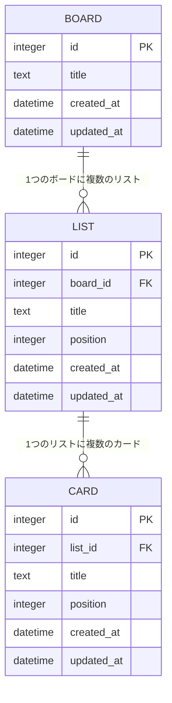

# タスク管理アプリ データベース設計

[要件定義書](requirements.md) に戻る

## 1. ER図

- MVPでは BOARD は常に1件のみ（1ユーザー・1ボードの制約に対応）
- `position` はリスト内・ボード内での表示順を表す整数値。DnDで移動した際に再計算して更新する
- `list_id` / `board_id` には外部キー制約を設定し、親（LIST/BOARD）削除時は子（CARD/LIST）も連動して削除する（ON DELETE CASCADE）

## 2. テーブル定義

**boards**

| カラム名 | 型 | 制約 | 説明 |
|----------|-----|------|------|
| id | INTEGER | PRIMARY KEY AUTOINCREMENT | ボードID |
| title | TEXT | NOT NULL | ボード名 |
| created_at | DATETIME | NOT NULL DEFAULT CURRENT_TIMESTAMP | 作成日時 |
| updated_at | DATETIME | NOT NULL DEFAULT CURRENT_TIMESTAMP | 更新日時 |

**lists**

| カラム名 | 型 | 制約 | 説明 |
|----------|-----|------|------|
| id | INTEGER | PRIMARY KEY AUTOINCREMENT | リストID |
| board_id | INTEGER | NOT NULL, FOREIGN KEY → boards.id ON DELETE CASCADE | 所属ボードID |
| title | TEXT | NOT NULL | リスト名 |
| position | INTEGER | NOT NULL | ボード内の表示順 |
| created_at | DATETIME | NOT NULL DEFAULT CURRENT_TIMESTAMP | 作成日時 |
| updated_at | DATETIME | NOT NULL DEFAULT CURRENT_TIMESTAMP | 更新日時 |

**cards**

| カラム名 | 型 | 制約 | 説明 |
|----------|-----|------|------|
| id | INTEGER | PRIMARY KEY AUTOINCREMENT | カードID |
| list_id | INTEGER | NOT NULL, FOREIGN KEY → lists.id ON DELETE CASCADE | 所属リストID |
| title | TEXT | NOT NULL | カードタイトル |
| position | INTEGER | NOT NULL | リスト内の表示順 |
| created_at | DATETIME | NOT NULL DEFAULT CURRENT_TIMESTAMP | 作成日時 |
| updated_at | DATETIME | NOT NULL DEFAULT CURRENT_TIMESTAMP | 更新日時 |

## 3. API仕様（概要）

| メソッド | エンドポイント | 内容 | 対応機能 |
|----------|----------------|------|----------|
| GET | /api/board | ボード全体（リスト・カードを含む）を取得 | 初期表示 |
| POST | /api/lists | リストを新規作成 | F1 |
| PATCH | /api/lists/:id | リスト名・表示順を更新 | F3, F7 |
| DELETE | /api/lists/:id | リストを削除（配下のカードも削除） | F2 |
| POST | /api/cards | カードを新規作成 | F4 |
| PATCH | /api/cards/:id | カードタイトル・所属リスト・表示順を更新 | F6, F7 |
| DELETE | /api/cards/:id | カードを削除 | F5 |

（機能IDの詳細は [機能一覧](features.md) を参照）
