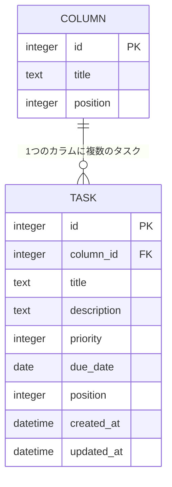

# TaskBoard データベース設計

[要件定義書](requirements.md) に戻る

## 1. ER図

- MVPではカラムは「未着手」「作業中」「完了」の3件で固定し、DB初期化時に登録する（アプリからの追加・削除・編集は行わない）
- `position` はカラム内でのタスクの表示順を表す整数値。DnDで移動した際、およびソートボタン実行時に再計算して更新する（ソート状態そのものは保持せず、常に `position` が唯一の表示順の根拠となる）
- `priority` は 1:低 / 2:中 / 3:高 の整数値（必須、初期値は2:中）、`due_date` は期限日（NULL可）
- `column_id` には外部キー制約を設定する

## 2. テーブル定義

**columns**

| カラム名 | 型 | 制約 | 説明 |
|----------|-----|------|------|
| id | INTEGER | PRIMARY KEY AUTOINCREMENT | カラムID |
| title | TEXT | NOT NULL | カラム名（未着手 / 作業中 / 完了） |
| position | INTEGER | NOT NULL | 画面上の表示順（左から順） |

**tasks**

| カラム名 | 型 | 制約 | 説明 |
|----------|-----|------|------|
| id | INTEGER | PRIMARY KEY AUTOINCREMENT | タスクID |
| column_id | INTEGER | NOT NULL, FOREIGN KEY → columns.id | 所属カラムID |
| title | TEXT | NOT NULL | タスクタイトル（100文字以内） |
| description | TEXT | NOT NULL DEFAULT '' | 説明 |
| priority | INTEGER | NOT NULL DEFAULT 2, CHECK (priority IN (1, 2, 3)) | 優先度（1:低 / 2:中 / 3:高） |
| due_date | DATE | NULL可 | 期限日 |
| position | INTEGER | NOT NULL | カラム内の表示順 |
| created_at | DATETIME | NOT NULL DEFAULT CURRENT_TIMESTAMP | 作成日時 |
| updated_at | DATETIME | NOT NULL DEFAULT CURRENT_TIMESTAMP | 更新日時 |

## 3. API仕様（概要）

| メソッド | エンドポイント | 内容 | 対応機能 |
|----------|----------------|------|----------|
| GET | /api/board | 全カラムとタスクを取得 | 初期表示 |
| POST | /api/tasks | タスクを新規作成（「未着手」カラムの末尾に追加） | F1 |
| PATCH | /api/tasks/:id | タイトル・説明・優先度・期限・所属カラム・表示順を更新 | F2, F4 |
| DELETE | /api/tasks/:id | タスクを削除 | F3 |
| POST | /api/columns/:id/sort | カラム内のタスクを `by=priority` または `by=due_date` で並び替え、結果を `position` に保存（1回限り・安定ソート） | F5 |

（機能IDの詳細は [機能一覧](features.md) を参照）
