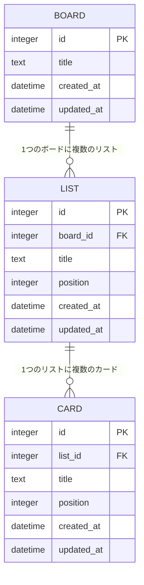

# タスク管理アプリ 要件定義書

## 1. 概要
Trello風のシンプルなタスク管理アプリ。ボード・リスト・カードの3階層でタスクを管理する。
まずは最小機能（MVP）で動くものを作り、後から機能を拡張していく。

## 2. スコープ（MVP）

### 対象
- フロントエンド（SPA）とバックエンドAPIで構成し、データはサーバー側のDB（SQLite）に永続化する
- 1ユーザー・1ボードを前提とする（複数ボード・複数ユーザーは対象外）

### 対象外（今回はやらない）
- ユーザー認証・ログイン
- 複数ボードの管理
- 複数人での同時編集・共有

## 3. 機能要件

| ID | 機能 | 内容 |
|----|------|------|
| F1 | リスト作成 | ボードに新しいリスト（列）を追加できる |
| F2 | リスト削除 | 不要なリストを削除できる |
| F3 | リスト名編集 | リストのタイトルを変更できる |
| F4 | カード作成 | リストに新しいカード（タスク）を追加できる |
| F5 | カード削除 | カードを削除できる |
| F6 | カード編集 | カードのタイトルを編集できる |
| F7 | カード移動（DnD） | カードをドラッグ&ドロップで別のリスト・別の位置に移動できる |
| F8 | データ永続化 | 上記の操作結果はバックエンドAPI経由でDB（SQLite）に保存され、再読み込み・再訪問後も保持される |

## 4. 非機能要件

### 対応環境
- 対応ブラウザ: Google Chrome / Microsoft Edge の最新版
- 画面サイズ: PCデスクトップ画面（1280px以上）を優先。レスポンシブ対応は必須としない
- OS: Windows / macOS の主要バージョン

### 性能・容量
- リスト数: 最大10程度、カード数: 1リストあたり最大50程度を想定した個人利用規模
- 操作（追加・削除・編集・DnD）に対する画面反映は体感1秒以内（フロントエンド〜バックエンドAPI間の通信を含む）
- SQLiteファイルサイズや行数について、個人利用規模である前提から特別な上限は設けない

### セキュリティ
- フロントエンド・バックエンド間はローカル環境内の通信を想定し、外部公開は行わない
- カードタイトル等の入力値は、画面表示前のエスケープに加え、バックエンドAPI側でもバリデーション（SQLインジェクション対策としてプレースホルダ/パラメータ化クエリを使用）を行う
- クレジットカード番号やパスワードなど機密情報の入力・保存は想定しない（利用者への注意喚起をREADME等に記載）
- ユーザー認証は対象外のため、APIは誰でもアクセス可能な前提とする（本番公開する場合は認証の追加が必須）

### アクセシビリティ・保守性
- 主要な操作（リスト/カードの追加・削除・編集）はキーボード操作でも実行可能とする（DnDによる移動はマウス操作を基本とし、キーボード代替は今後の拡張候補とする）
- コンポーネント単位で機能を分割し、拡張候補（9章参照）に対応しやすい構成とする

## 5. データモデル

### 5.1 ER図



- MVPでは BOARD は常に1件のみ（1ユーザー・1ボードの制約に対応）
- `position` はリスト内・ボード内での表示順を表す整数値。DnDで移動した際に再計算して更新する
- `list_id` / `board_id` には外部キー制約を設定し、親（LIST/BOARD）削除時は子（CARD/LIST）も連動して削除する（ON DELETE CASCADE）

### 5.2 テーブル定義

**boards**

| カラム名 | 型 | 制約 | 説明 |
|----------|-----|------|------|
| id | INTEGER | PRIMARY KEY AUTOINCREMENT | ボードID |
| title | TEXT | NOT NULL | ボード名 |
| created_at | DATETIME | NOT NULL DEFAULT CURRENT_TIMESTAMP | 作成日時 |
| updated_at | DATETIME | NOT NULL DEFAULT CURRENT_TIMESTAMP | 更新日時 |

**lists**

| カラム名 | 型 | 制約 | 説明 |
|----------|-----|------|------|
| id | INTEGER | PRIMARY KEY AUTOINCREMENT | リストID |
| board_id | INTEGER | NOT NULL, FOREIGN KEY → boards.id ON DELETE CASCADE | 所属ボードID |
| title | TEXT | NOT NULL | リスト名 |
| position | INTEGER | NOT NULL | ボード内の表示順 |
| created_at | DATETIME | NOT NULL DEFAULT CURRENT_TIMESTAMP | 作成日時 |
| updated_at | DATETIME | NOT NULL DEFAULT CURRENT_TIMESTAMP | 更新日時 |

**cards**

| カラム名 | 型 | 制約 | 説明 |
|----------|-----|------|------|
| id | INTEGER | PRIMARY KEY AUTOINCREMENT | カードID |
| list_id | INTEGER | NOT NULL, FOREIGN KEY → lists.id ON DELETE CASCADE | 所属リストID |
| title | TEXT | NOT NULL | カードタイトル |
| position | INTEGER | NOT NULL | リスト内の表示順 |
| created_at | DATETIME | NOT NULL DEFAULT CURRENT_TIMESTAMP | 作成日時 |
| updated_at | DATETIME | NOT NULL DEFAULT CURRENT_TIMESTAMP | 更新日時 |

### 5.3 API仕様（概要）

| メソッド | エンドポイント | 内容 | 対応機能 |
|----------|----------------|------|----------|
| GET | /api/board | ボード全体（リスト・カードを含む）を取得 | 初期表示 |
| POST | /api/lists | リストを新規作成 | F1 |
| PATCH | /api/lists/:id | リスト名・表示順を更新 | F3, F7 |
| DELETE | /api/lists/:id | リストを削除（配下のカードも削除） | F2 |
| POST | /api/cards | カードを新規作成 | F4 |
| PATCH | /api/cards/:id | カードタイトル・所属リスト・表示順を更新 | F6, F7 |
| DELETE | /api/cards/:id | カードを削除 | F5 |

## 6. 画面仕様

### 6.1 画面イメージ（ボード画面）

```
+--------------------------------------------------+
| [リスト: 未着手]   [リスト: 進行中]   [リスト: 完了] |
| ---------------   ---------------   ------------ |
| □ カードA          □ カードC          □ カードE    |
| □ カードB          □ カードD                       |
| [+ カード追加]      [+ カード追加]      [+ カード追加]|
+--------------------------------------------------+
| [+ リスト追加]                                     |
+--------------------------------------------------+
```

- 画面はボード画面の1つのみ（画面遷移は発生しない、モーダル表示のみで完結する）

### 6.2 モーダル・入力UIの振る舞い

| 操作 | UI要素 | 開閉・表示ルール |
|------|--------|------------------|
| リスト追加 | 「+ リスト追加」クリックでインライン入力欄を表示 | 入力欄外クリックまたはEscキーでキャンセル、Enterで確定 |
| リスト名編集 | リストタイトルをクリックでインライン編集に切り替え | Enterで確定、Escキーでキャンセル |
| リスト削除 | リストメニューの「削除」ボタン | 確認モーダルを表示し、「削除する/キャンセル」を選択させる |
| カード追加 | 「+ カード追加」クリックでインライン入力欄を表示 | 入力欄外クリックまたはEscキーでキャンセル、Enterで確定 |
| カード編集 | カードクリックで編集モーダルを表示 | モーダル内でタイトルを編集し、「保存/キャンセル」ボタンで確定・破棄。モーダル外クリックはキャンセル扱い |
| カード削除 | カード編集モーダル内の「削除」ボタン | 確認モーダルを表示し、「削除する/キャンセル」を選択させる |
| カード移動（DnD） | カードをドラッグして別リスト・別位置にドロップ | ドロップ先が不正な場合（対象外領域など）は元の位置に戻す |

### 6.3 バリデーション・エラー表示

| ケース | 表示位置・内容 |
|--------|----------------|
| リスト名・カードタイトルが未入力のまま確定しようとした場合 | 入力欄の直下に赤字で「タイトルを入力してください」と表示し、確定不可とする |
| リスト名・カードタイトルが規定文字数（例: 100文字）を超えた場合 | 入力欄の直下に赤字で「100文字以内で入力してください」と表示し、確定不可とする |
| バックエンドAPIとの通信に失敗した場合（サーバー未起動・タイムアウト等） | 画面上部にエラーバナーを表示し「サーバーとの通信に失敗しました。しばらくしてから再度お試しください」と案内する。直前の操作は反映せずロールバックする |
| APIから予期しないエラーレスポンス（5xx等）が返却された場合 | 画面上部にエラーバナーを表示し「データの保存に失敗しました」と案内し、操作前の状態を維持する |

## 7. ユースケース（操作シナリオ）

### UC1: リストとカードを作成してタスクを管理する
1. 利用者はボード画面を開く（初回はリストが0件の空の状態）
2. 「+ リスト追加」をクリックし、「未着手」「進行中」「完了」の3つのリストを作成する
3. 各リストの「+ カード追加」からタスクをカードとして登録する
4. タスクの進捗に応じて、カードを「未着手」から「進行中」、「完了」へドラッグ&ドロップで移動する
5. 完了したタスクのカードを削除する（確認モーダルで削除を確定）
6. ブラウザを閉じて再度開いても、直前の状態が復元されていることを確認する

### UC2: カードのタイトルを修正する
1. 利用者はボード画面上の対象カードをクリックする
2. カード編集モーダルが開き、現在のタイトルが入力欄に表示される
3. タイトルを修正し、「保存」ボタンをクリックする
4. モーダルが閉じ、ボード上のカード表示が更新される

### UC3: 不要になったリストを削除する
1. 利用者は削除したいリストのメニューから「削除」を選択する
2. 確認モーダルが表示され、「このリストと含まれる全カードが削除されます」という警告文とともに削除可否を確認される
3. 「削除する」を選択すると、リストとリスト内の全カードが削除され、localStorageにも反映される

## 8. 技術スタック

| 項目 | 選定技術 | 選定理由 |
|------|----------|----------|
| フロントエンドフレームワーク | React | コンポーネント単位での開発がしやすく、学習資料・情報量が豊富なため保守性が高い |
| ビルドツール | Vite | 開発サーバーの起動・ホットリロードが高速で、設定がシンプル |
| ドラッグ&ドロップ | dnd-kit | Reactとの親和性が高く、アクセシビリティ（キーボード操作対応）への拡張余地もあるライブラリ |
| バックエンドフレームワーク | Node.js + Express | フロントエンドと言語を統一でき（JavaScript/TypeScript）、学習コストが低い。シンプルなREST APIの構築に適している |
| データベース | SQLite | ローカル完結でサーバーやミドルウェアのセットアップが不要。個人利用・学習規模のデータ量に十分対応できる |
| DBアクセス | better-sqlite3 などのライブラリ | Node.jsから同期的にSQLiteを操作でき、シンプルな構成で実装できるため |
| 実行環境 | Node.js | フロントエンド（Vite/React）・バックエンド（Express）共通の実行環境 |
| 言語 | JavaScript（または TypeScript） | チームの学習状況に応じて選択。型安全性を重視する場合はTypeScriptを推奨 |

## 9. 今後の拡張候補（MVP後）

- 複数ボード管理
- カードの詳細（説明・期限・ラベル・チェックリスト）
- 複数端末からのアクセス（現状はローカル環境での起動を想定）
- ユーザー認証・複数人共有
